# NextVault 🌌

<div align='center'>

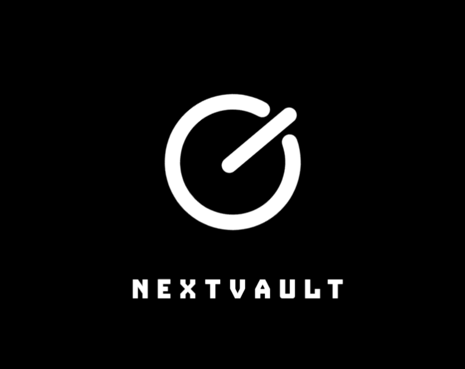

</div>


> **A local-first, offline-capable ecosystem turning your PC into a powerful Dashboard/Server and your Android device into an ultimate connected client. No internet required.**

---

## 📖 Introduction
**NextVault** is an innovative local-first software ecosystem designed to seamlessly connect a desktop server/dashboard with mobile clients over a local network. It acts as a bridge for offline communities, allowing users to share media, host chatrooms, distribute applications, and moderate content without ever needing an active internet connection.

Built with a focus on professional, ultra-modern design (Dark Neumorphism & Glassmorphism elements), it provides an immersive and interactive user experience.

---

| Image | Image |
|---|---|
| 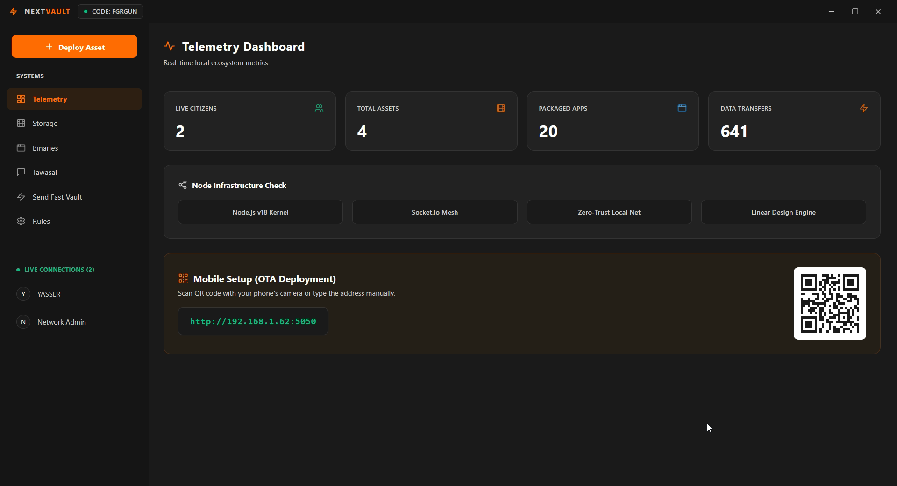 | 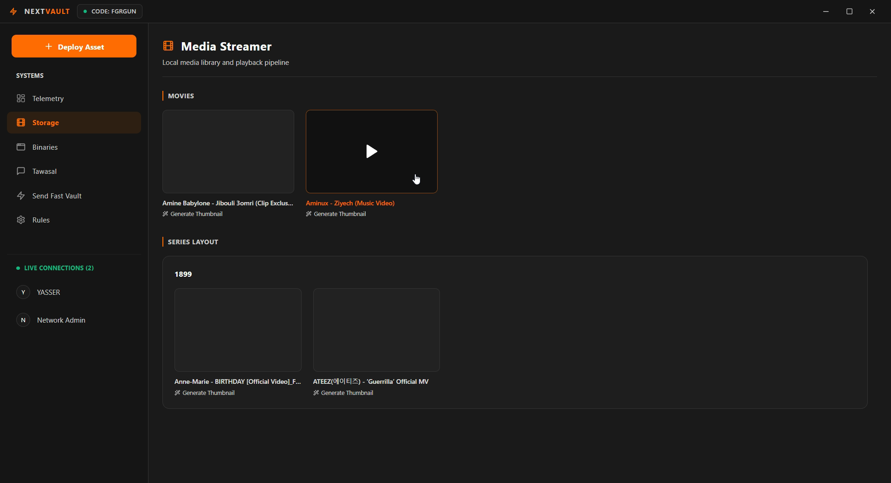 |
| 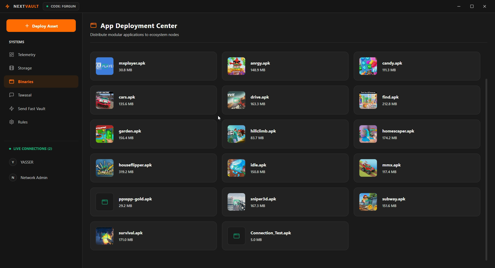 | 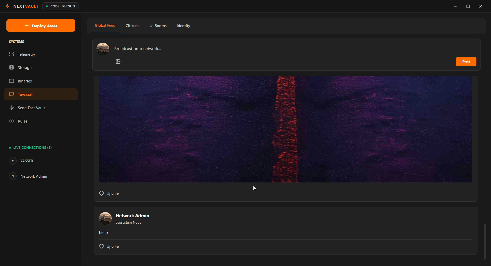 |


| Image | Image |
|---|---|
| 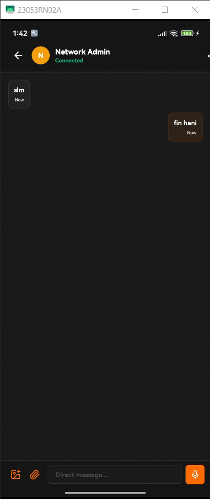 | 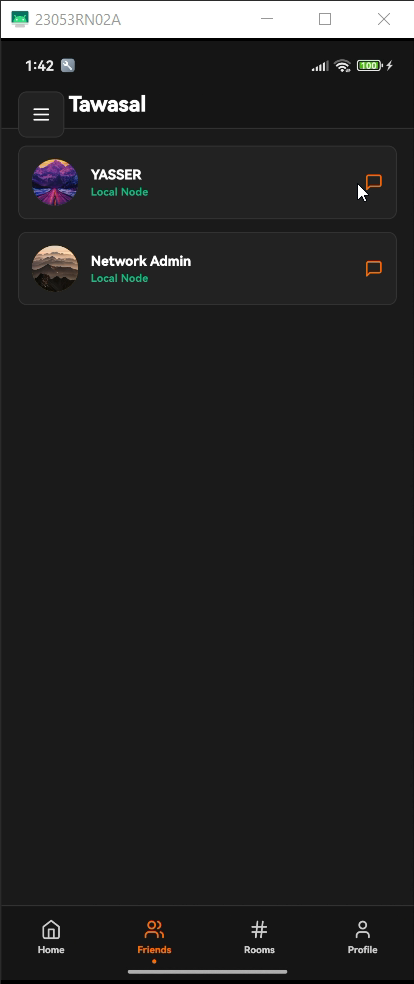 |
| 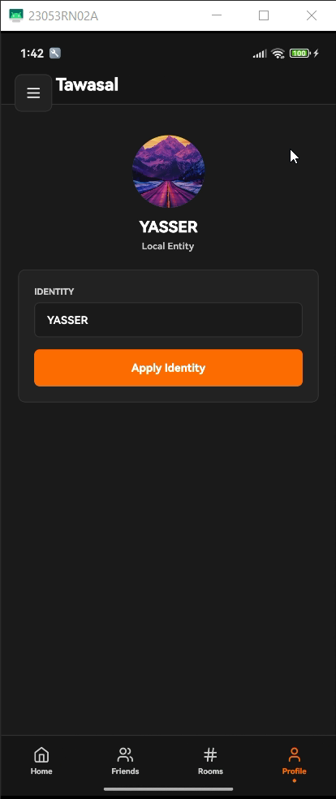 | 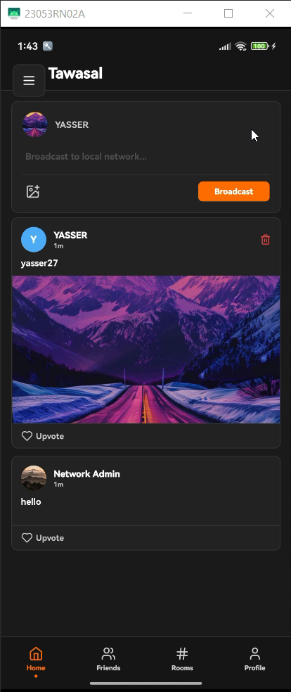 |


| Image | Image |
|---|---|
| 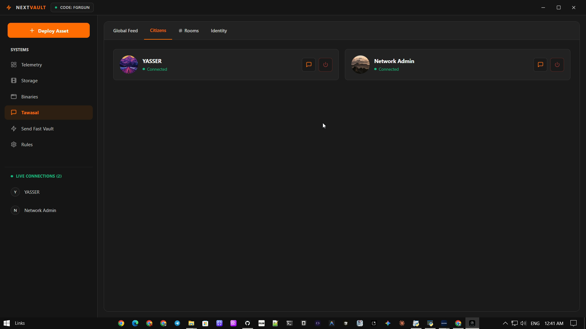 | 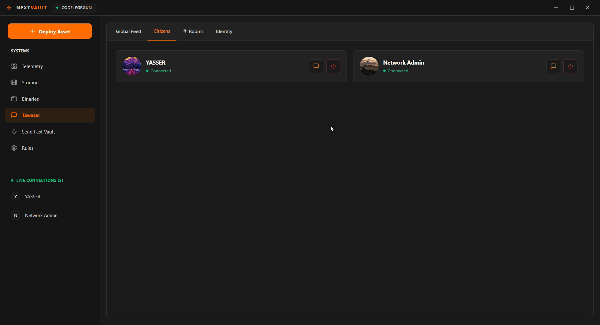 |
| 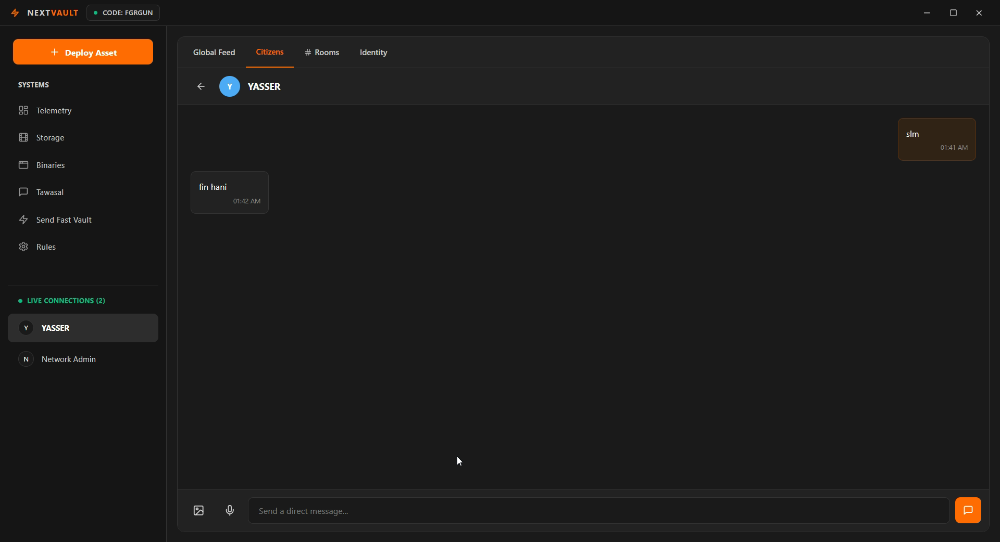 |  |


| Image | Image |
|---|---|
| 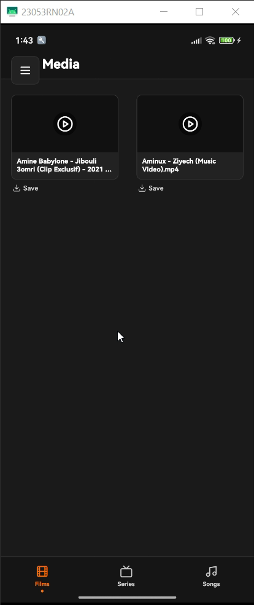 | 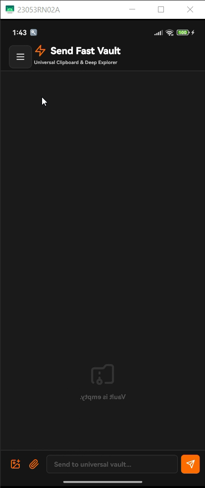 |
| 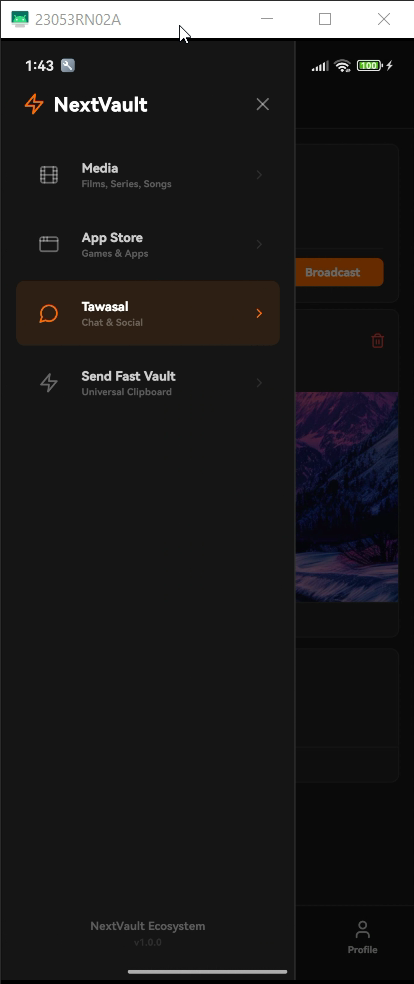 | 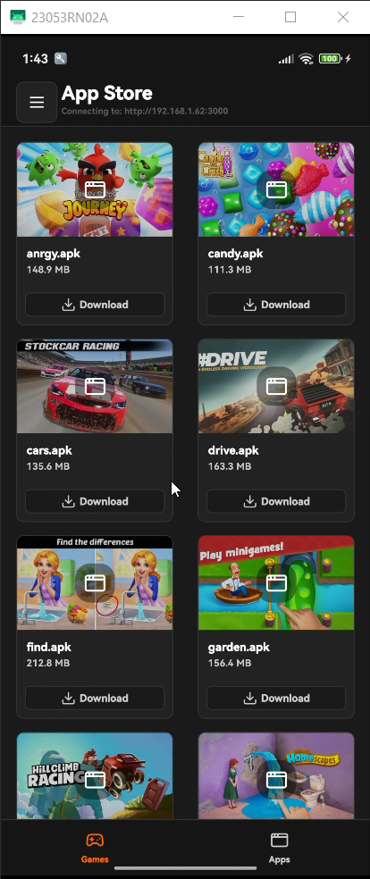 |


## ✨ Key Features

### 🎬 Media Streaming (Artplayer & Plyr)
- **Local Netflix-like Experience:** Browse and stream Films, Series, and Music directly from your PC to your phone.
- **Robust Video Players:** Integrated **`Artplayer`** and **`Plyr`** handle video playback smoothly across any network condition.

### 🏪 Offline App Store (APK Distribution)
- **Host Your Own Apps:** Easily distribute `.apk` files directly from the Server's `Android` folder.
- **1-Click Installation:** Over-the-air native downloading and auto-prompt installation on Android via Expo's `FileSystem` and native `IntentLauncher`.

### 🛡️ "Tawasal" Moderation System
- **Real-Time Communication:** A localized chat system with powerful oversight tools.
- **Smart Moderation:** Set forbidden words and automatically censor unauthorized content in real-time.
- **Dashboard Control:** Admins can kick or block users, moderate messages, and track network stats directly from the PC dashboard.

---

## 🎨 UI/UX Design

NextVault takes user experience to the next level by adopting **Dark Neumorphism** combined with **Glassmorphism**.
- **The Dashboard:** A professional React-Vite built control panel with a responsive Grid layout, deep-dark color palettes, glowing gradients, and subtle micro-animations (powered by Tailwind HTML & Lucide React Icons).
- **The Mobile App:** Sleek, dark-themed native Android UI utilizing `react-native-safe-area-context` to feel perfectly cohesive with modern Android hardware.

---

## 📂 Project Structure

```text
C:\after
├── Server/                   # The PC Dashboard & Backend API
│   ├── src/                  # React + Vite Frontend
│   ├── backend/              # Express JS Server (Port: 3000)
│   ├── main.js               # Electron Desktop App Entry
│   ├── Tawasal/              # Specialized Chat System Files
│   ├── Android/              # Store your APK files here (auto-served)
│   └── media/                # Store your Films, Series, and Songs here
│
└── android-client/           # The Mobile App Client
    ├── App.js                # React Native Entry
    ├── src/                  # Screens, Components, Configs
    └── android/              # Native Android Build Configuration
```

---

## ⚙️ Technical Specs
- **Frontend (Server):** React 18, Vite, TailwindCSS, Lucide React.
- **Backend (Server):** ExpressJS, Multer (File Uploads), Cors.
- **Desktop Wrapper:** Electron (with `utilityProcess` for robust background Node.js processes without locking).
- **Mobile Client:** React Native (Expo SDK 54, Custom Native Builds).

### Core API Endpoints
- `GET /api/apps` - Fetches available APKs from `Android/` folder.
- `GET /api/media` - Lists available movies and audio in `media/`.
- `GET /api/posts` & `POST /api/posts` - Tawasal Feed and auto-censored chat routes.
- `POST /api/upload` - General media and APK upload handler.
- `POST /api/upload-audio` - Dedicated Base64 audio uploader for voice messages.
- Statically Served Folders: `/media`, `/apps`, `/voice`, `/tawasal`.

---

## 🚀 Installation & Build Guide

### 1. Server Dashboard (Electron)
The Server must be running on your PC for the mobile app to function.

**To Run in Development:**
```bash
cd Server
npm install
npm run dev
```

**To Build the Production Installer (.exe):**
```bash
cd Server
npm run build:electron
```
> **Output:** Head to `Server/release/`. You will find either `win-unpacked` (Portable Folder) or the Setup installer `NextVault Setup 1.0.0.exe`. The app securely generates missing directories when executed.

### 2. Android Mobile Client
Ensure that the PC and the Android device are connected to the same Wi-Fi router.

**To Update the Local Server IP:**
1. Open `android-client/src/config/api.js`.
2. Update the `BASE_URL` to match your PC's IP address (e.g., `http://192.168.1.10:3000`).

**To Build the APK:**
```bash
cd android-client
npm install
# Generate the native Android project (Skip if already done)
npx expo prebuild
# Build the production APK natively
cd android
./gradlew assembleRelease
```
> **Output:** The .apk file will be successfully generated at `android-client/android/app/build/outputs/apk/release/app-release.apk`.

---

## 👨‍💻 Developer Note
Designed, Engineered, and Maintained internally by **Yasser (YASSER-27)**.

*This README describes the architectural integrity achieved during our development session. Do not distribute without authorization.*

# arabic
#  NextVault 

> **نظام بيئي متكامل يعمل محلياً، يحول حاسوبك الشخصي إلى سيرفر ولوحة تحكم قوية، ويجعل جهاز الـ Android الخاص بك أداة متصلة كلياً دون الحاجة إلى أي اتصال بالإنترنت.**

---

## 📖 مقدمة
**NextVault** هو نظام برمجي مبتكر مصمم لربط سيرفر (ومحطة عمل) محلي على الحاسوب مع تطبيق يعمل على الهواتف بمجرد الاتصال على نفس الشبكة المحلية. التطبيق يخلق منصة ووسيطاً للمجتمعات المحرومة من الإنترنت أو المعزولة، مما يتيح للمستخدمين مشاركة الوسائط، وإنشاء غرف دردشة، وتوزيع التطبيقات، ومراقبة المحتوى بفعالية ومجاناً.

تم بناء واجهاته بتركيز حاد على الاحترافية والتصميم بالغ الحداثة (يستلهم من أنماط Dark Neumorphism و Glassmorphism) ليمنح المستخدمين تجربة تفاعلية وبصرية لا تضاهى.

---

## ✨ أبرز المميزات

### 🎬 البث الإعلامي (Artplayer & Plyr)
- **تجربة Netflix المحلية:** إمكانية تصفح وبث الأفلام المدمجة، المسلسلات، والموسيقى مباشرة من الحاسوب لشاشات الهواتف.
- **مشغّلات فائقة الحداثة:** يعتمد النظام على اندماج مكتبات **`Artplayer`** و **`Plyr`** للتعامل مع الفيديوهات بسلاسة تامة أياً كانت ظروف الشبكة.

### 🏪 متجر تطبيقات بدون إنترنت (تثبيت الـ APK)
- **مخزن تطبيقات خاص بك:** إمكانية تخصيص ورفع حزم وتطبيقات (`.apk`) من مجلد `Android` الموجود بداخل السيرفر وتوزيعها.
- **تثبيت بضغطة زر واحدة:** تحميل مباشر من الشبكة المحلية ومطالبة تلقائية بنظام Android بالتثبيت عن طريق صلاحيات `FileSystem` و `IntentLauncher` الأصيلة.

### 🛡️ نظام الاعتدال "Tawasal"
- **تواصل لحظي وفعّال:** نظام محادثة مغلق ومحلي مع أدوات إشرافية رائدة.
- **الرقابة الذكية للمحتوى:** يمكنك كمسؤول إعداد قائمة "بالكلمات المحظورة" وسيقوم النظام أوتوماتيكياً بطمسها (***) أثناء الكتابة وإرسالها بالزمن الفعلي.
- **لوحة التحكم المركزية:** يتمتع المسؤول بصلاحيات استبعاد وحظر المستخدمين، تتبع ورصد عمليات رفع الملفات واستهلاك الشبكة مباشرة من الحاسوب.

---

## 🎨 تجربة وتصميم المستخدم (UI/UX)

ينتقل مشروع NextVault بالتجربة البصرية لمستوى احترافي عالي من خلال تبني طيف **النيومورفيزم المظلم (Dark Neumorphism)** مع شظايا من الـ **Glassmorphism**.
- **لوحة التحكم (Dashboard):** بُنيت باستخدام React و Vite لتقديم شبكة عصرية (Grid Layout) بألوان مظلمة أنيقة، وتدرجات ضوئية، ومؤثرات حركية دقيقة مدعومة بأيقونات Lucide وتقنيات Tailwind.
- **تطبيق الهواتف:** واجهة داكنة مريحة للعين تستحوذ بكفاءة على مساحة الهاتف بفضل `react-native-safe-area-context` وتجعل التصفح مثالياً.

---

## 📂 هيكلية المشروع

```text
C:\after
├── Server/                   # لوحة تحكم الحاسوب والواجهة الخلفية للمشروع 
│   ├── src/                  # واجهة React + Vite
│   ├── backend/              # سيرفر Express JS (المنفذ: 3000)
│   ├── main.js               # الواجهة البرمجية لتطبيق Electron
│   ├── Tawasal/              # ملفات نظام الدردشة المخصصة
│   ├── Android/              # مجلد التوزيع التلقائي لتطبيقات الـ APK
│   └── media/                # مجلد رفع الأفلام والمسلسلات والأغاني
│
└── android-client/           # تطبيق الهاتف (العميل)
    ├── App.js                # ملف البداية للـ React Native
    ├── src/                  # شاشات، واجهات المستخدم، الإعدادات
    └── android/              # إعدادات البناء الأصيلة (Native Build)
```

---

## ⚙️ المواصفات التقنية
- **الواجهة الأمامية للسيرفر:** React 18, Vite, TailwindCSS, Lucide React.
- **الواجهة الخلفية للسيرفر:** ExpressJS, Multer (لرفع الملفات), Cors.
- **حاوي التطبيق المكتبي:** Electron (بواسطة `utilityProcess` لتفادي تجمد المعالج أثناء تشغيل أوامر Node.js).
- **تطبيق العميل:** React Native (مع تخصيص Expo SDK 54 للإصدارات المستقلة عن الإنترنت).

### مسارات الـ API الأساسية المعتمدة
- `GET /api/apps` - التقاط وتوزيع ألعاب وتطبيقات من المجلدات الفرعية.
- `GET /api/media` - فهرست الصوتيات والمرئيات وعرضها.
- `GET /api/posts` و `POST /api/posts` - مسارات الدردشة ونشر المحتوى للـ Tawasal.
- `POST /api/upload` - المسار الخاص باستقبال التطبيقات والأفلام.
- `POST /api/upload-audio` - التقاط الملفات الصوتية بصيغة Base64 ورفعها وحفظها.
- الملفات المقدمة كـ Static Files: `/media`, `/apps`, `/voice`, `/tawasal`.

---

## 🚀 طريقة التثبيت والتشغيل

### 1. سيرفر لوحة التحكم (Electron)
يجب تشغيل السيرفر على شبكة حاسوبك أولاً حتى يتمكن الهاتف من الربط.

**للتشغيل في وضع المطور:**
```bash
cd Server
npm install
npm run dev
```

**لبناء الحزمة المغلقة للمستخدمين (.exe):**
```bash
cd Server
npm run build:electron
```
> **المخرجات:** توجه إلى المسار `Server/release/`. ستجد المجلد `win-unpacked` جاهزاً، أو بإمكانك تنصيب مثبت البرنامج الاحترافي `NextVault Setup 1.0.0.exe`. وبمجرد التشغيل، سيتكفل السيرفر ببناء كل المجلدات المفقودة للحفاظ على الخصوصية والمساحة.

### 2. تطبيق الهاتف المحمول (Android)
يُشترط ضرورة تواجد الجهازين على نفس شبكة التوجيه (الراوتر) المحلي.

**لتحديث المسار المحلي الخاص بالسيرفر:**
1. توّجه للمسار: `android-client/src/config/api.js`.
2. حدّث المتغير `BASE_URL` بالـ IP الخاص بحاسوبك (مثلاً: `http://192.168.1.10:3000`).

**لبناء ملف التطبيق (APK):**
```bash
cd android-client
npm install
# استخراج المشروع الأصيل لأندرويد
npx expo prebuild
# بدء بناء التحديث الإنتاجي الخاص بـ Release
cd android
./gradlew assembleRelease
```
> **المخرجات:** ستعثر على تطبيق الـ apk الناجح في مسار الانتهاء:
`android-client/android/app/build/outputs/apk/release/app-release.apk`.

---

## 👨‍💻 تنويه المطور
جرى تصميمُه، برمجتُه، وصيانتُه داخلياً بواسطة المطور الرئيسي المحترف **Yasser (YASSER-27)**.

*هذا الـ README يوثّق الهيكل المعماري والنجاح البرمجي في نسخته الإنتاجية، وهو بمثابة مرجع رسمي. يُحظر كلياً إعادة التوزيع دون إذن مسبق.*
